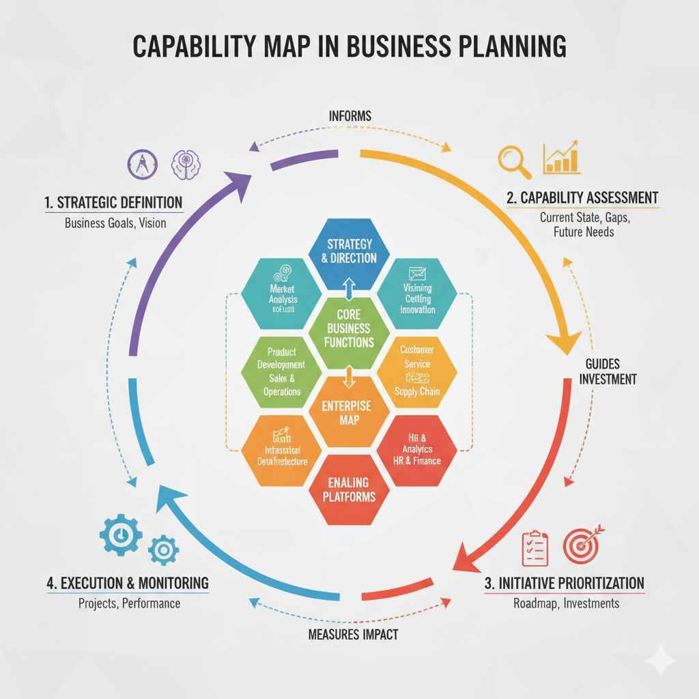
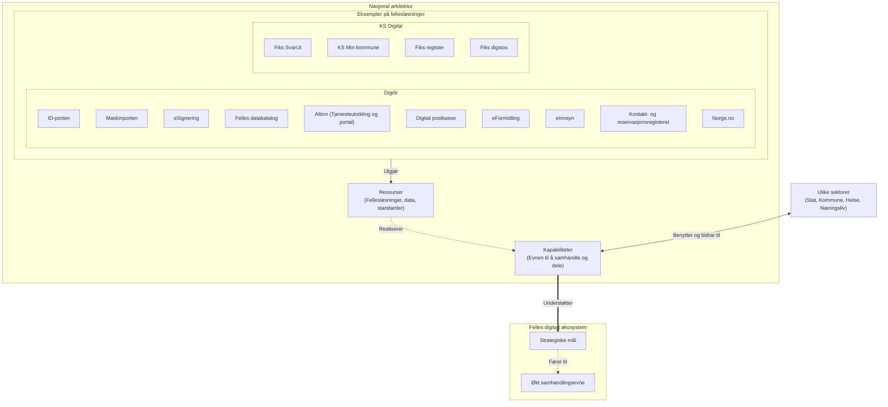

# Hva er Nasjonal Arkitektur?

**Hva er felles økosystem?**
Felles økosystem for nasjonal digital samhandling og tjenesteutvikling er en samling verktøy og løsninger som kan brukes på tvers for å utvikle digitale tjenester. Hovedmålet med økosystemet er at offentlige tjenester skal oppleves som sammenhengende og helhetlige for både innbyggere og næringsliv, uavhengig av hvilken etat eller kommune som faktisk tilbyr dem.

Digdir har også utarbeidet en konkret modell for felles økosystem. Denne modellen illustrerer hvordan vi kan ivareta samhandling på juridisk, organisatorisk, semantisk og teknisk nivå. Konseptet hjelper forvaltningen med å bryte opp komplekse tjenester i håndterbare bolker og viser avhengighetene mellom ulike aktører og systemer.

I en norsk kontekst er nasjonal arkitektur et overordnet rammeverk for hvordan offentlig sektor - i samspill med privat sektor - bygger og setter sammen digitale løsninger. Rammeverket forvaltes av Digitaliseringsdirektoratet (Digdir).

Hovedmålet med nasjonal arkitektur er å etablere et **felles digitalt økosystem**. Dette fungerer som felles "kjøreregler" og "byggeklosser", og legger til rette for:

* **Sammenhengende tjenester:** Innbyggere og næringsliv skal oppleve offentlige tjenester som sømløse og brukervennlige, på tvers av kommuner, direktorater og etater. Brukerens behov settes i sentrum, ikke hvordan forvaltningen er organisert.
* **Deling av data ("Kun én gang"):** Systemer skal utveksle informasjon på en sikker måte slik at brukerne slipper å oppgi samme opplysninger til det offentlige mer enn én gang.
* **Gjenbruk av fellesløsninger:** Virksomheter skal gjenbruke nasjonale felleskomponenter (som ID-porten, Altinn og Maskinporten) fremfor å utvikle egne, overlappende løsninger. Dette sparer samfunnet for store summer.
* **Samhandling (Interoperabilitet):** For at systemer skal kunne "snakke sammen", definerer nasjonal arkitektur standarder, referansearkitekturer og prinsipper for teknisk, semantisk, organisatorisk og juridisk samhandling.
* **Tillit og sikkerhet:** Informasjonssikkerhet og innebygd personvern er fundamentale byggeklosser for å sikre befolkningens tillit til offentlige digitale tjenester.

Kort fortalt sikrer nasjonal arkitektur at vi bygger et moderne, bærekraftig og effektivt digitalt Norge som trekker i samme retning.

## Relaterte temaer
* [Informasjonsforvaltning](informasjonsforvaltning.md) - Les mer om hvordan vi strukturerer og forvalter data etter Digdirs prinsipper.

## Konseptuell skisse

Diagrammet under illustrerer forholdet mellom aktørene, kapabilitetene i Nasjonal arkitektur, og hvordan dette understøtter strategiske mål for økt samhandlingsevne i et felles økosystem.

